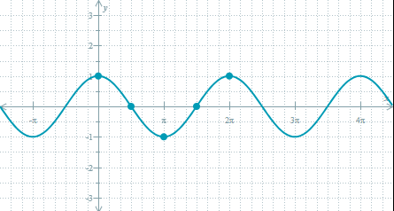
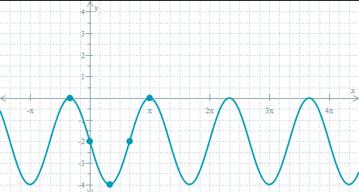

## Trigonometric Functions

### Key Objectives

1. Transfer from degree measure to radian measure and vice versa.
2. Use equilateral and isosceles triangles to compute the values of the six trigonometric functions at any multiple of 30 and 45 degrees.
3. Construct graphs of the six trigonometric functions and find their periods.
4. Find the period and graph trig functions of the form $y = A \sin(B (x - C)) + D$
5. Use the inverse trig functions to find angles.
6. Apply trigonometry to compute distances (such as heights of buildings, distances to travel, etc.)

### Transfer from degree measure to radian measure and vice versa.

| $$D = {R * {180 \over \pi}}$$                      | $$R = {D * {\pi \over 180}}$$   |
|----------------------------------------------------|---------------------------------|
| Convert $3 \pi \over 7$ radians to degree measure. | Convert 266° to radian measure. |
| $D = {3 \pi \over 7} * {180 \over \pi}$            | $R = 266 * {\pi \over 180}$     |
| $D = 77.14$                                        | $R = 4.64$                     |

### Use equilateral and isosceles triangles to compute the values of the six trigonometric functions at any multiple of 30 and 45 degrees.

### Construct graphs of the six trigonometric functions and find their periods.

|$$y = {3 \over 2}\sin({1 \over 2}x)$$|$$y = -2\cos(3x)$$      |$$y = \tan(\pi x + {\pi \over 2})$$|
|:-----------------------------------:|:----------------------:|:---------------------------------:|
|             ||           |
|Period = $4\pi$                      |Period = $2\pi \over 3$ |Period = $$                        |

|$$y = 2\csc({\pi x \over2})$$|$$y = \sec(x + {\pi \over 4})$$|$$y = \cot({\pi x \over 2})$$ |
|:---------------------------:|:-----------------------------:|:----------------------------:|
|     |       |                              |
|Period = $$                  |period = $2\pi$                |Period = $3\pi \over 4$       |
### Find the period and graph trig functions of the form $y = A \sin(B (x - C)) + D$

Graph $y = 2\cos({3 \over 2}(x + {\pi \over 3}))- 2$

Break down the equation, start from the bottom and work your way through it.

$y = \cos(x)$

$y = \cos({3 \over 2}x)$

$y = 2\cos({3 \over 2}x)$

$y = 2\cos({3 \over 2}x)- 2$

$y = 2\cos({3 \over 2}(x + {\pi \over 3}))- 2$

The period is $3\pi \over 2$

### Use the inverse trig functions to find angles.

| $$y = \sin^{-1} x$$                | $$y = \cos^{-1} x$$              | $$y = \tan^{-1} x$$      |
|------------------------------------|----------------------------------|--------------------------|
| $\sin^{-1} (- {\sqrt{3} \over 2})$ | $\cos^{-1} ({\sqrt{2} \over 2})$ | $\tan^{-1} (\sqrt{3})$   |
| $-{\pi \over 3}$ or $120°$         | $-{\pi \over 4}$ or $45°$        | ${\pi \over 3}$ or $60°$ |

### Apply trigonometry to compute distances (such as heights of buildings, distances to travel, etc.)

The horizontal distance D of an object launched at an angle $\theta$ with initial velocity $v$ is given by the following formula.

$D = {v^{2}\sin(2\theta) \over g}$

If $g = 9.8 \space m/s^2$, find the horizontal distance of an object when $v = 90 \space m/s$, and $\theta = {2\pi \over 5}$ rad. Round your answer to the nearest hundredth.

Fill in the values and simplity.

|$D = {v^{2}\sin(2\theta) \over g}$|
|----------------------------------|
|$D = {90^{2}\sin(2{2\pi \over 5}) \over 9.8}$|
|$D = {8100\sin({4\pi \over 5}) \over 9.8}$|
|$D = 485.82 \space m$|